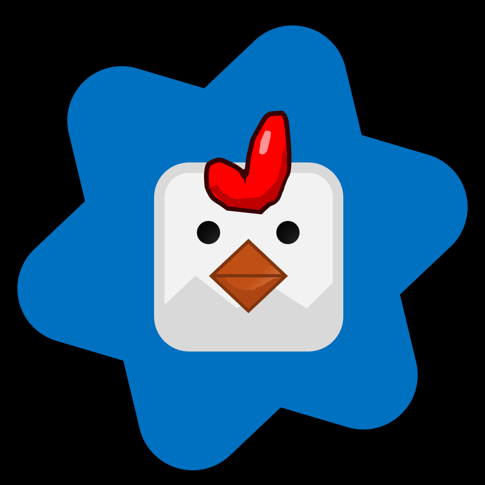

<div align="center">

|  | **OpenCG** |
| :--- | :--- |

Hello! This is the open-source version of **Chicken Gun** — a first-person shooter game featuring chickens, made with Unity.

</div>

---

## About the Project

Chicken Gun is a multiplayer FPS where players control chickens and fight each other using a variety of weapons.
Source by: Chicken Gun Community

---

## Requirements

- Unity 2019.4 (recommended)  
- Windows 10 or higher  
- PC supporting OpenGL or DirectX  

---

## Installation and Running

1. Clone the repository:  
   ```bash
   git clone https://github.com/Nestor1232323/chicken-gun.git
2. Create a new Unity project (3D template recommended).

3. Replace the project's Assets and other relevant folders with the contents from the cloned repository.

4. Open the project in Unity Editor.

5. Build the project for Windows or run it directly inside the Unity Editor.

## Contributing
Feel free to open issues or submit pull requests if you'd like to help improve the project.

## License
This project is licensed under the MIT License. You are free to modify and use it.

## Warning!!
If you want to protect project, change the compilation from mono to il2cpp!!
